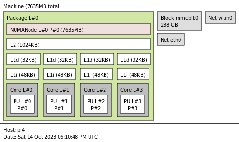

# qdisc testing on SoC devices

This repo has some code used to test different qdiscs on multiple SoC devices.

Essentially, using x2 laptops as client and server, the tests iterate through each device and qdisc to measure the performance.

See full doc here:
https://docs.google.com/document/d/1fYKj3BS89aB9drg_DsSq289xSdVQhn1zUJYCj0WuCs0/edit#heading=h.bpvv3vr500nw

## Current issues

1. cake20 and cake40

The idea was to insert latency via netem on both laptops with 20ms and 40ms. All the tests have been done at 20ms for now, however on the devices
the qdisc conf is set for the different rtts. I will work to add the code to change the netem latency.

    	cake20)
    		# https://www.man7.org/linux/man-pages/man8/tc-cake.8.html
    		echo ip netns exec network"${namespace}" tc qdisc replace dev "${vlan_dev}"."${vlan}" root cake ether-vlan bandwidth "${bandwidth}" rtt 20ms ack-filter
    		ip netns exec network"${namespace}" tc qdisc replace dev "${vlan_dev}"."${vlan}" root cake ether-vlan bandwidth "${bandwidth}" rtt 20ms ack-filter
    		;;
    	cake40)
    		# https://www.man7.org/linux/man-pages/man8/tc-cake.8.html
    		echo ip netns exec network"${namespace}" tc qdisc replace dev "${vlan_dev}"."${vlan}" root cake ether-vlan bandwidth "${bandwidth}" rtt 40ms ack-filter
    		ip netns exec network"${namespace}" tc qdisc replace dev "${vlan_dev}"."${vlan}" root cake ether-vlan bandwidth "${bandwidth}" rtt 40ms ack-filter
    		;;

2.  IPv4 only

Definitely want to add ipv6

3. flent

Flent doesn't work on ubuntu LTS because of a fping issue: https://github.com/tohojo/flent/issues/232
Need to work out that to do about this.

## Testing steps

### Before test steps

Before running the tests, the device is rebooted, switch interface counters cleared, and details gathered.
The before steps Gathering both "show interface blah" and SNMP counters, because the SNMP counters are not cleared.
The counters are gather before and after the tests.

```bash
das@3rd:/tmp/qdisc/2023-10-13T18:45:45/pi4/fq/iperf/before_test$ ls -la
total 68
drwxr--r-- 17 das das 4096 Oct 13 19:21 .
drwxr--r--  5 das das 4096 Oct 13 19:36 ..

drwxr--r--  2 das das 4096 Oct 13 19:20 1_ansible_ping_before_reboot
drwxr--r--  2 das das 4096 Oct 13 19:21 2_ansible_reboot
drwxr--r--  2 das das 4096 Oct 13 19:21 3_ansible_ping_after_reboot
drwxr--r--  2 das das 4096 Oct 13 19:21 4_configure_qdiscs
drwxr--r--  2 das das 4096 Oct 13 19:21 5_icmp_ping
drwxr--r--  3 das das 4096 Oct 13 19:21 6_gather_details
drwxr--r--  2 das das 4096 Oct 13 19:21 7_clear_device_interface_counters
drwxr--r--  2 das das 4096 Oct 13 19:21 8_clear_laptop_3rd_interface_counters
drwxr--r--  2 das das 4096 Oct 13 19:21 9_clear_laptop_ryzen_interface_counters
<snip>
drwxr--r--  2 das das 4096 Oct 13 19:21 10_get_snmp_interface_counters
drwxr--r--  2 das das 4096 Oct 13 19:21 11_get_snmp_interface_counters_laptop_3rd
drwxr--r--  2 das das 4096 Oct 13 19:21 12_get_snmp_interface_counters_laptop_ryzen
drwxr--r--  2 das das 4096 Oct 13 19:21 13_show_interface_counters
drwxr--r--  2 das das 4096 Oct 13 19:21 14_show_interface_counters_laptop_3rd
drwxr--r--  2 das das 4096 Oct 13 19:21 15_show_interface_counters_laptop_ryzen
```

### Test

This runs iperf.

The plan was to run flent, but flent doesn't work on ubuntu because of bug https://github.com/tohojo/flent/issues/232.

### After test steps

```bash
das@3rd:/tmp/qdisc/2023-10-13T18:45:45/pi4/fq/iperf/after_test$ ls -la
total 40
drwxr--r-- 10 das das 4096 Oct 13 19:37 .
drwxr--r--  5 das das 4096 Oct 13 19:36 ..
drwxr--r--  2 das das 4096 Oct 13 19:37 17_icmp_ping
drwxr--r--  3 das das 4096 Oct 13 19:37 18_gather_details
drwxr--r--  2 das das 4096 Oct 13 19:37 19_get_snmp_interface_counters
drwxr--r--  2 das das 4096 Oct 13 19:37 20_get_snmp_interface_counters_laptop_3rd
drwxr--r--  2 das das 4096 Oct 13 19:37 21_get_snmp_interface_counters_laptop_ryzen
drwxr--r--  2 das das 4096 Oct 13 19:37 22_show_interface_counters
drwxr--r--  2 das das 4096 Oct 13 19:37 23_show_interface_counters_laptop_3rd
drwxr--r--  2 das das 4096 Oct 13 19:37 24_show_interface_counters_laptop_ryzen
```

## Running the tests

The basic steps are:

1. Prerequisires
   Armbrian installed on the devices.
   Ubuntu server minimal LTS on the laptops.
   das user created, with ssh authrorized keys setup to allow ssh login.

2. Setup devices
   Go to the device_info folder and type "make".

   This should install the required packages, update the system, install sudoers capabilities for "das" user.

   This also installs the ansible config.

3. Setup Ansible. ( I had a lot of troubles with Ansible versions. Stock in ubuntu seems the best. Don't recommend updating)

   To check Ansible is working you can do "make ping" in the ansible folder.

```bash
das@t:~/Downloads/cake/ansible$ make ping
ANSIBLE_STRATEGY=free ansible devices -i ./ansible_hosts -m ping
pi4 | SUCCESS => {
    "changed": false,
    "ping": "pong"
}
nanopi-r5c | SUCCESS => {
    "changed": false,
    "ping": "pong"
}
jetson-nano | SUCCESS => {
    "changed": false,
    "ping": "pong"
}
nanopi-neo3 | SUCCESS => {
    "changed": false,
    "ping": "pong"
}
pi3b | SUCCESS => {
    "changed": false,
    "ping": "pong"
}
asus-cn60-2 | SUCCESS => {
    "changed": false,
    "ping": "pong"
}
nanopi-r2s | SUCCESS => {
    "changed": false,
    "ping": "pong"
}
nanopi-r1 | SUCCESS => {
    "changed": false,
    "ping": "pong"
}
lpi4a | SUCCESS => {
    "changed": false,
    "ping": "pong"
}
ANSIBLE_STRATEGY=free ansible laptops -i ./ansible_hosts -m ping
3rd | SUCCESS => {
    "changed": false,
    "ping": "pong"
}
ryzen | SUCCESS => {
    "changed": false,
    "ping": "pong"
}

```

4. Copy files
   Run "make copy" to copy the required scripts to the devices and laptops. Copies to /home/das/Downloads/cake/

5. Configure networks on each device

   "make qdiscs" will setup all the devices and laptops.

   Or you can run this on each.
   "make qdiscs_devices"
   "make qdiscs_laptops"

6. Verificiation
   There's also a test script to check all the networks are pinging.
   /home/das/Downloads/cake/configure_device_scripts/qdisc_ping_test.bash

7. Start iperf server and netserver for flent on the ryzen laptop

   This script will kill any existing iperf and netserver instances and restart them.

   [./tests/start_iperf_server_and_netserver_laptop.bash](./tests/start_iperf_server_and_netserver_laptop.bash)

./start_iperf_server_and_netserver_laptop.bash

```bash
das@ryzen:~/Downloads/cake/tests$ ls -la
total 40
drwxrwxr-x  2 das das  4096 Oct  2 12:49 .
drwxrwxr-x 12 das das  4096 Oct 10 08:19 ..
-rwxr-xr-x  1 das das   661 Sep  5 21:04 start_flent_laptop.bash
-rwxr-xr-x  1 das das 10198 Oct 10 17:08 start_iperf_client_laptop.bash
-rwxr-xr-x  1 das das  9127 Oct 10 17:08 start_iperf_client_laptop.perl
-rwxr-xr-x  1 das das  1733 Oct 11 16:14 start_iperf_server_and_netserver_laptop.bash
das@ryzen:~/Downloads/cake/tests$ ./start_iperf_server_and_netserver_laptop.bash
```

8. Run the tests

The golang binary has lots of options, but for a real run set:
"-reboot" which will reboot the target device before test. This is done to clear the counters.
"-iperfTimeSeconds 900" will run the iperf for 15 minutes

Recommend starting screen/tmux

```bash
~/Downloads/cake/cmd/run_qdiscs_tests
./run_qdiscs_tests -reboot -iperfTimeSeconds 900
```

The output data goes into /tmp/qdisc/<timestamp>. The debugging log goes to stdout and to a file /tmp/qdisc/<timestamp>/log.json, so you can tail the log

The golang tester also has live prometheus metrics, so you can use curl to see how it's progressing. ( I haven't made a dashboard )

```bash
das@t:/tmp/qdisc$ curl --silent http://3rd:9111/metrics | grep tester | grep counters_qdisc
# HELP counters_qdisc_tester qdisc tester counters
# TYPE counters_qdisc_tester counter
counters_qdisc_tester{device="pi4",function="executeAnsible",qdisc="cake20",type="counter"} 11
counters_qdisc_tester{device="pi4",function="executeAnsible",qdisc="fq",type="counter"} 15
counters_qdisc_tester{device="pi4",function="executeAnsible",qdisc="fq_codel",type="counter"} 15
counters_qdisc_tester{device="pi4",function="executeAnsible",qdisc="noqueue",type="counter"} 15
counters_qdisc_tester{device="pi4",function="executeAnsible",qdisc="pfifo_fast",type="counter"} 15
counters_qdisc_tester{device="pi4",function="executeIperf",qdisc="cake20",type="counter"} 1
counters_qdisc_tester{device="pi4",function="executeIperf",qdisc="fq",type="counter"} 1
counters_qdisc_tester{device="pi4",function="executeIperf",qdisc="fq_codel",type="counter"} 1
counters_qdisc_tester{device="pi4",function="executeIperf",qdisc="noqueue",type="counter"} 1
counters_qdisc_tester{device="pi4",function="executeIperf",qdisc="pfifo_fast",type="counter"} 1
counters_qdisc_tester{device="pi4",function="gatherAndRsyncDetailsFromTestDevice",qdisc="cake20",type="counter"} 1
counters_qdisc_tester{device="pi4",function="gatherAndRsyncDetailsFromTestDevice",qdisc="fq",type="counter"} 2
counters_qdisc_tester{device="pi4",function="gatherAndRsyncDetailsFromTestDevice",qdisc="fq_codel",type="counter"} 2
counters_qdisc_tester{device="pi4",function="gatherAndRsyncDetailsFromTestDevice",qdisc="noqueue",type="counter"} 2
counters_qdisc_tester{device="pi4",function="gatherAndRsyncDetailsFromTestDevice",qdisc="pfifo_fast",type="counter"} 2
counters_qdisc_tester{device="pi4",function="getSNMPInterfaceCounters",qdisc="cake20",type="counter"} 3
counters_qdisc_tester{device="pi4",function="getSNMPInterfaceCounters",qdisc="fq",type="counter"} 6
counters_qdisc_tester{device="pi4",function="getSNMPInterfaceCounters",qdisc="fq_codel",type="counter"} 6
counters_qdisc_tester{device="pi4",function="getSNMPInterfaceCounters",qdisc="noqueue",type="counter"} 6
counters_qdisc_tester{device="pi4",function="getSNMPInterfaceCounters",qdisc="pfifo_fast",type="counter"} 6
counters_qdisc_tester{device="pi4",function="icmpPing",qdisc="cake20",type="counter"} 1
counters_qdisc_tester{device="pi4",function="icmpPing",qdisc="fq",type="counter"} 2
counters_qdisc_tester{device="pi4",function="icmpPing",qdisc="fq_codel",type="counter"} 2
counters_qdisc_tester{device="pi4",function="icmpPing",qdisc="noqueue",type="counter"} 2
counters_qdisc_tester{device="pi4",function="icmpPing",qdisc="pfifo_fast",type="counter"} 2
counters_qdisc_tester{device="pi4",function="newStep",qdisc="cake20",type="counter"} 16
counters_qdisc_tester{device="pi4",function="newStep",qdisc="fq",type="counter"} 24
counters_qdisc_tester{device="pi4",function="newStep",qdisc="fq_codel",type="counter"} 24
counters_qdisc_tester{device="pi4",function="newStep",qdisc="noqueue",type="counter"} 24
counters_qdisc_tester{device="pi4",function="newStep",qdisc="pfifo_fast",type="counter"} 24
counters_qdisc_tester{device="pi4",function="testDeviceQdisc",qdisc="",type="counter"} 1
counters_qdisc_tester{device="pi4",function="testDeviceQdisc",qdisc="cake20",type="counter"} 1
counters_qdisc_tester{device="pi4",function="testDeviceQdisc",qdisc="fq",type="counter"} 1
counters_qdisc_tester{device="pi4",function="testDeviceQdisc",qdisc="fq_codel",type="counter"} 1
counters_qdisc_tester{device="pi4",function="testDeviceQdisc",qdisc="noqueue",type="counter"} 1
counters_qdisc_tester{device="pi4",function="testDeviceQdisc",qdisc="pfifo_fast",type="counter"} 1
counters_qdisc_tester{device="pi4",function="writeStepDetails",qdisc="cake20",type="counter"} 15
counters_qdisc_tester{device="pi4",function="writeStepDetails",qdisc="fq",type="counter"} 24
counters_qdisc_tester{device="pi4",function="writeStepDetails",qdisc="fq_codel",type="counter"} 24
counters_qdisc_tester{device="pi4",function="writeStepDetails",qdisc="noqueue",type="counter"} 24
counters_qdisc_tester{device="pi4",function="writeStepDetails",qdisc="pfifo_fast",type="counter"} 24
```

Options:

```bash
das@t:~/Downloads/cake/cmd/run_qdiscs_tests$ ./run_qdiscs_tests --help
Usage of ./run_qdiscs_tests:
-cakePath string
 	file path containing the config files (default "/home/das/Downloads/cake")
-debugLevel int
 	nasty debugLevel (default 11)
-devicesFilename string
 	filename with the list of devices (default "devices.txt")
-fastForward string
 	fastFoward to step.  This option allows you to specific the a named step, mostly to speed up the testing cycle
-intCountersFilename string
 	filename with the list of interface counters to collect (default "interface_counters_to_collect.txt")
-intMapFilename string
 	filename with the device to switch interface mapping (default "device_to_interface_mapping.txt")
-intSNMPMapFilename string
 	filename with the switch interface to snmp index (default "interface_to_snmp_index.txt")
-iperfIntervalSeconds int
 	iperfIntervalSeconds (default 10)
-iperfParallel int
 	iperfParallel (default 20)
-iperfTimeBufferSeconds int
 	iperfTimeBufferSeconds (default 10)
-iperfTimeSeconds int
 	iperfTimeSeconds (default 60)
-laptopsFilename string
 	filename with the list of laptops (default "laptops.txt")
-outputPath string
 	Output path (default "/tmp/qdisc/")
-promListen string
 	Prometheus http listening socket (default ":9111")
-promPath string
 	Prometheus http path. Default = /metrics (default "/metrics")
-qdiscsFilename string
 	filename with the list of qdiscs (default "qdiscs.txt")
-reboot
 	reboot devices before tests if this is set
-version
 	version

```

Outputs are stored in a lots of detail, so you can see what happened at each step. You can see stdout and stderr, and timing information.

## Code

This repo is using:

- bash scripts
  Originally everything was written in bash, but that obviously became limiting, so I switched to golang.
  ( I actualy switched to perl for a few hours until I remember how much better golang is for everything. )

- golang
  The golang itself is mostly calling ansible and bash, with the go code being mostly control.

- ansible
  Ansible isn't great, and it's slow (python), but at least it's fairly well adopted, and does handle most of the error handling, so I don't need to worry.
  Given the tests are likely to run over many hours, being a little slow measured in seconds isn't really a concern.

- rsync
  When gathering details from the devices, the scripts run locally on the device, and then the data get's rsynced across. This was mostly for reliability.

- Makefiles
  Makefiles are mosty used to hold a series of command, and aren't really Makefiles. The idea is that you can look at the Makefile in most of the
  directories and you can easily work out what commands to run. Hopefully "make all" will do something useful in most cases.

## Layout

| File                                                                             | Summary           | Description                                                                                                    |
| -------------------------------------------------------------------------------- | ----------------- | -------------------------------------------------------------------------------------------------------------- |
| [./cmd/run_qdiscs_tests/]                                                        |                   |                                                                                                                |
| [./pkg/run_qdiscs_tests/run_qdiscs_tests.go](./pkg/qdisc_tester/qdisc_tester.go) | main()            | Golang binary to run the qdisc tests. This is mostly a light wrapper around qdisc_tester                       |
| [./pkg/qdisc_tester/qdisc_tester.go](./pkg/qdisc_tester/qdisc_tester.go)         | qdisc_tester      | qdisc_tester is where most of the go code to run the tests lives                                               |
|                                                                                  |                   |                                                                                                                |
| [./cmd/generate_device_specific_configs/]                                        |                   | Little helper program to generation the configure_device_scripts                                               |
|                                                                                  |                   |                                                                                                                |
| [./script_configuration](./script_configuration)                                 | Script configs    | Input files for the scripts ( devices, qdiscs, laptops, device_to_interface_mapping, snmp counter, etc )       |
|                                                                                  |                   |                                                                                                                |
| [./ansible](./ansible)                                                           | Ansible playbooks | Ansible playbooks and hosts file lives here                                                                    |
| [./device_info](./device_info)                                                   | Outputs           | This folder contains lots of device specific information to be used for reference. This is a folder per device |
|                                                                                  |                   |                                                                                                                |
| [./configure_device_scripts](./configure_device_scripts)                         | Bash scripts      | Bash scripts to configure all the namespace, vlans, IPs, qdiscs on each device                                 |
|                                                                                  |                   |                                                                                                                |
| [./misc_info](./misc_info)                                                       | Misc              | All good projects need a catch-all bucket ;)                                                                   |
|                                                                                  |                   |                                                                                                                |
| [./tests](./tests)                                                               | Tests             | Contains the older code to run the tests                                                                       |
|                                                                                  |                   |                                                                                                                |
| [./.trunk](./.trunk)                                                             | Linter            | Linter configuration                                                                                           |
|                                                                                  |                   |                                                                                                                |
| [./Makefile](./Makefile)                                                         | Makefile          | Makefile holds some shortcuts to commands                                                                      |
| [./copy.bash](./copy.bash)                                                       | Copy.bash         | Copies files from this folder to all the devices and laptops                                                   |

## Layout - tree

```bash
das@t:~/Downloads/cake$ tree -d -L 2
.
├── ansible
├── cmd
│   ├── generate_device_specific_configs
│   └── run_qdiscs_tests
├── configure_device_scripts
├── device_info
│   ├── asus-cn60-2
│   ├── jetson-nano
│   ├── nanopi-neo3
│   ├── nanopi-r1
│   ├── nanopi-r2s
│   ├── nanopi-r5c
│   ├── pi3b
│   └── pi4
├── misc_info
├── pkg
│   └── qdisc_tester
├── script_configuration
├── test_outputs
└── tests

20 directories
```

## Gather details

To help understand all the different devices, there are scripts to gether lots of details about them.

To do this, there's an ansible playbook that runs a heap of commands on each device, and puts the output into a tmp folder.
Then the details are rsynced to the control machine.

[./gather_details_locally/gather_details_local.bash](./gather_details_locally/gather_details_local.bash)

To run the scripts do this:

```bash
~/Downloads/cake/device_info

make create_device_dirs

make gather_details_locally

make rsync
```

There's a second version which gathers a more limited set of command before/after the tests.

[./gather_details_locally/gather_details_for_tests.bash](./gather_details_locally/gather_details_for_tests.bash)

This means that if there are any questions about a device, you can look at all the outputs here. There is also a .png with the system hardware layout.

[./device_info/pi4/hwloc-ls-pi4.png](./device_info/pi4/hwloc-ls-pi4.png)



```bash
das@t:~/Downloads/cake/device_info/pi4$ pwd
/home/das/Downloads/cake/device_info/pi4

das@t:~/Downloads/cake/device_info/pi4$ ls -la
total 480
drwxr-xr-x  2 das das   4096 Oct  2 17:56 .
drwxrwxr-x 10 das das   4096 Oct  6 10:54 ..
-rw-r--r--  1 das das  62802 Oct  2 17:24 dpkg_list
-rw-r--r--  1 das das    224 Oct  2 17:24 ethtool_driver_eth0
-rw-r--r--  1 das das    166 Oct  2 17:24 ethtool_phy_statistics_eth0
-rw-r--r--  1 das das      0 Oct  2 17:24 ethtool_show_coalesc_eth0
-rw-r--r--  1 das das   1966 Oct  2 17:24 ethtool_show_features_eth0
-rw-r--r--  1 das das      0 Oct  2 17:24 ethtool_show_ringm_eth0
-rw-r--r--  1 das das   2482 Oct  2 17:24 ethtool_statistics_eth0
-rw-r--r--  1 das das 252746 Oct  2 17:24 hwinfo
-rw-r--r--  1 das das   1308 Oct  2 17:24 hwinfo_network
-rw-r--r--  1 das das    388 Oct  2 17:24 hwloc-ls
-rw-r--r--  1 das das  17912 Oct  2 17:24 hwloc-ls-pi4.png
-rw-r--r--  1 das das   1582 Oct  2 17:24 ip_addr_show
-rw-r--r--  1 das das   1218 Oct  2 17:24 ip_link_show
-rw-r--r--  1 das das    133 Oct  2 17:24 ip_route_show
-rw-r--r--  1 das das     42 Oct  2 17:24 ip_Version
-rw-r--r--  1 das das    917 Oct  2 17:24 lldpcli_show_neighbors
-rw-r--r--  1 das das    104 Oct  2 17:24 lsb_release
-rw-r--r--  1 das das   9047 Oct  2 17:24 lshw
-rw-r--r--  1 das das    900 Oct  2 17:24 lshw_class_network
-rw-r--r--  1 das das    271 Oct  2 17:24 lspci_k
-rw-r--r--  1 das das   1662 Oct  2 17:24 netstat_statistics
-rw-r--r--  1 das das    387 Oct  2 17:24 os_release
-rw-r--r--  1 das das    940 Oct  2 17:24 proc_cpuinfo
-rw-r--r--  1 das das   2141 Oct  2 17:24 proc_interrupts
-rw-r--r--  1 das das   1445 Oct  2 17:24 proc_meminfo
-rw-r--r--  1 das das    571 Oct  2 17:24 proc_net_dev
-rw-r--r--  1 das das  38720 Oct  2 17:24 sysctl_a
-rw-r--r--  1 das das     42 Oct  2 17:24 tc_Version
-rw-r--r--  1 das das    111 Oct  2 17:24 uname_a

das@t:~/Downloads/cake/device_info/pi4$ head netstat_statistics
IcmpMsg:
    InType3: 280
    InType8: 3681
    OutType0: 3681
    OutType3: 280
Tcp:
    48718 active connection openings
    35 passive connection openings
    48701 failed connection attempts
    17 connection resets received
...
```
